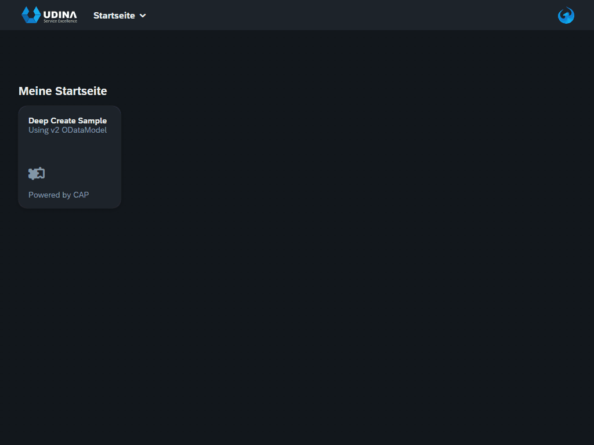

# sapui5-deep-create
This is a sample repo to demonstrate the usage of the SAPUI5 oData V2 Model [DeepCreate](https://sapui5.hana.ondemand.com/1.108.0/#/topic/6c47b2b39db9404582994070ec3d57a2.html#loio4c4cd99af9b14e08bb72470cc7cabff4/section_DCR) feature introduced with release 1.108.

Attention!!! This is a work in progress to get the main points.



It contains these folders and files, following our recommended project layout:

File or Folder | Purpose
---------|----------
`app/` | content for UI frontends goes here
`db/` | your domain models and data go here
`srv/` | your service models and code go here
`package.json` | project metadata and configuration
`readme.md` | this getting started guide

## Local Setup
With the first steps below, you can go for a minimal [local setup](https://cap.cloud.sap/docs/get-started/#local-setup) as follows:

1. [Install Node.js](https://nodejs.org/en/) → always use the latest LTS version.
2. [Install SQLite](https://sqlite.org/download.html) (only required on Windows).
3. Install @sap/cds-dk globally with:
4. Install package deps, because odata v2 proxy is not part of cds-dk

```bash
npm i -g @sap/cds-dk
npm i
```

## Start application

- Open a new terminal and run `cds watch --open index.html?sap-ui-xx-viewCache=false` 
- (in VS Code simply choose _**Terminal** > Run Task > cds watch_) or simply use CTRL + SHIFT + B (WIN)
- Start adding content, for example, a [db/schema.cds](db/schema.cds).

## Description
This example implements the SAP API [Sales Order (A2X)](https://api.sap.com/api/OP_API_SALES_ORDER_SRV_0001/overview) (used in SAP S/4HANA Public and onPrem) concerning the relevant [Business Context](https://help.sap.com/docs/SAP_S4HANA_ON-PREMISE/19d48293097f4a2589433856b034dfa5/00d244581efca007e10000000a441470.html?locale=en-US) as a CAP mock service.

In the meantime, this API also supports $batch to split header and items creations, but API [Sales Order Simulation](https://help.sap.com/docs/SAP_S4HANA_ON-PREMISE/19d48293097f4a2589433856b034dfa5/0ae72864ca5f405dadceed4693562aa8.html?locale=en-US) still does not. 

It should also just be an example, if you have to use an unmanaged ABAP implementation (especially insided Business Suite and SAP GW) where you need to pass in a deep structure.

## Default data
See the initial [Mock Data](http://localhost:4004/v2/mock/SalesOrder?$select=SalesOrder,SalesOrderType,SalesOrganization,DistributionChannel,OrganizationDivision&$expand=to_Item) for SalesOrder expanded with to_Item 

## Issues

### Using Deep Create with expanded columns in List Report
With initial release 1.108.0, there is currently an issue, that DeepCreate can not be used behind expanded list report columns. For this reason, inside **ListReport.view.xml** the used property **XnavigationProperty** that created the $expand is commented out for the moment. If this is fixed, i will readd this feature.

### Need for manual fix after regenerating CSN from EDMX
The generator does not create the relevant to_Item association.

This is manually fixed inside **API_SALES_ORDER_SRV.csn** after creation using the following snippet:

```json
"to_Item": {
    "@cds.ambiguous": "missing on condition?",
    "type": "cds.Association",
    "target": "API_SALES_ORDER_SRV.A_SalesOrderItem",
    "cardinality": {
    "max": "*"
    },          
    "on": [
    {
        "ref": [
        "to_Item",
        "SalesOrder"
        ]
    },
    "=",
    {
        "ref": [
        "SalesOrder"
        ]
    }
    ]
},
```

### async issue ObjectPage sometime showing
Sometime initial call shows ObjectNotFoundPage