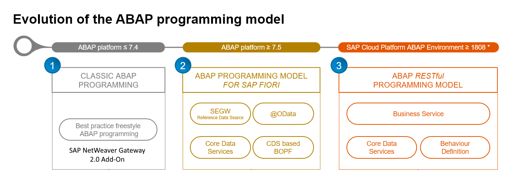
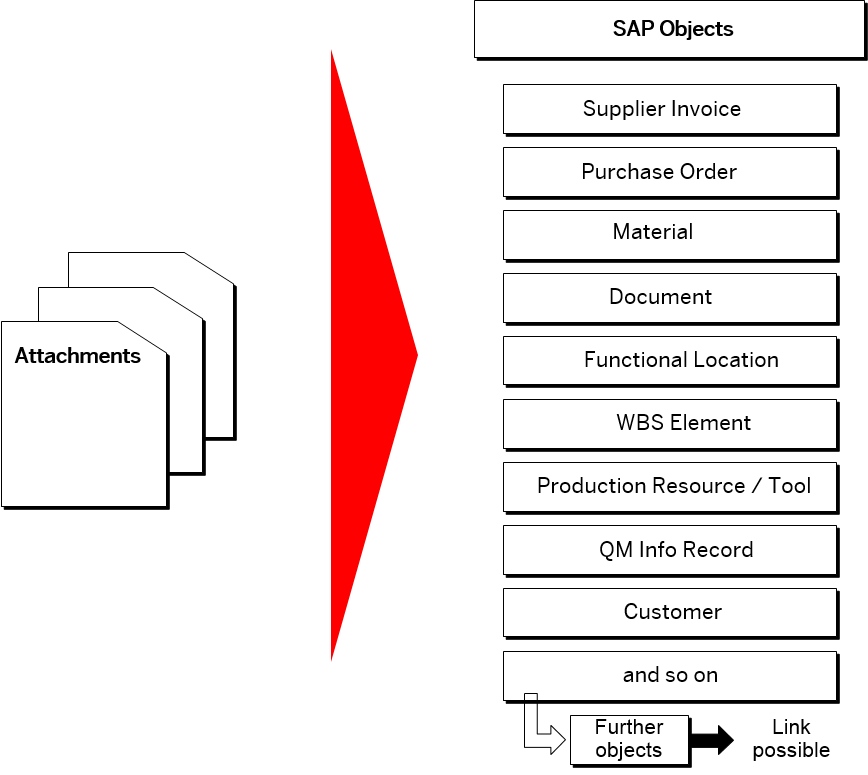
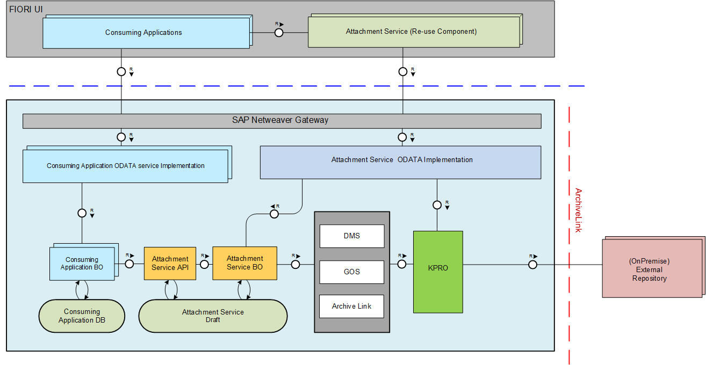

# sapui5-deep-create
This is a sample repo to demonstrate the usage of the SAPUI5 oData V2 Model [DeepCreate](https://sapui5.hana.ondemand.com/1.108.0/#/topic/6c47b2b39db9404582994070ec3d57a2.html#loio4c4cd99af9b14e08bb72470cc7cabff4/section_DCR) feature introduced with release 1.108.

Attention!!! This is a work in progress to get the main points.


It contains these folders and files, following our recommended project layout:

File or Folder | Purpose
---------|----------
`app/` | content for UI frontends goes here
`db/` | your domain models and data go here
`srv/` | your service models and code go here
`package.json` | project metadata and configuration
`readme.md` | this getting started guide

## Local Setup
With the first steps below, you can go for a minimal [local setup](https://cap.cloud.sap/docs/get-started/#local-setup) as follows:

1. [Install Node.js](https://nodejs.org/en/) → always use the latest LTS version.
2. [Install SQLite](https://sqlite.org/download.html) (only required on Windows).
3. Install @sap/cds-dk globally with:
4. Install package deps, because odata v2 proxy is not part of cds-dk

```bash
npm i -g @sap/cds-dk
npm i
```

## Start application

- Open a new terminal and run `cds watch --open index.html?sap-ui-xx-viewCache=false` 
- (in VS Code simply choose _**Terminal** > Run Task > cds watch_) or simply use CTRL + SHIFT + B (WIN)
- Start adding content, for example, a [db/schema.cds](db/schema.cds).

## Description
This example implements the SAP API [Sales Order (A2X)](https://api.sap.com/api/OP_API_SALES_ORDER_SRV_0001/overview) (used in SAP S/4HANA Public and onPrem) concerning the relevant [Business Context](https://help.sap.com/docs/SAP_S4HANA_ON-PREMISE/19d48293097f4a2589433856b034dfa5/00d244581efca007e10000000a441470.html?locale=en-US) as a CAP mock service.

In the meantime, this API also supports $batch to split header and items creations, but API [Sales Order Simulation](https://help.sap.com/docs/SAP_S4HANA_ON-PREMISE/19d48293097f4a2589433856b034dfa5/0ae72864ca5f405dadceed4693562aa8.html?locale=en-US) still does not. 

It should also just be an example, if you have to use an unmanaged ABAP implementation (especially insided Business Suite and SAP GW) where you need to pass in a deep structure.

## Default data
See the initial [Mock Data](http://localhost:4004/v2/mock/SalesOrder?$select=SalesOrder,SalesOrderType,SalesOrganization,DistributionChannel,OrganizationDivision&$expand=to_Item) for SalesOrder expanded with to_Item 

## Design decisions
The app tries to follow the [SAP Fiori Design Guideline](https://experience.sap.com/fiori-design-web/) as muchg as possible while trying to mimic some of the SAP Fiori Elements v4 implementation paradigmen, to be somehow compatible in between.

### Message Page
The current sap.m.MessagePage will become deprecated in the future, because it does not fullfill the [SAP Fiori Evolution for Horizon](https://experience.sap.com/fiori-design-web/sap-fiori/#sap-fiori-with-horizon) UX.

Therefore the NotFound and ObjectNotFound view implements the [Illustrated Message](https://experience.sap.com/fiori-design-web/illustrated-message/) design pattern.

## Issues

### Using Deep Create with expanded columns in List Report
With initial release 1.108.0, there is currently an issue, that DeepCreate can not be used behind expanded list report columns. For this reason, inside **ListReport.view.xml** the used property **XnavigationProperty** that created the $expand is commented out for the moment. If this is fixed, i will readd this feature.

## SAPUI5 Freestyle development for Brownfield (unmanaged) scenarios
Today, using the latest SAP S/4HANA system with SAP Fiori Elements v4, you will get out-of-the-box draft support for you entities and dependencies in Greenfield (managed) scenarios. 

>Brownfield implementation means scenarios where existing legacy code such as a BAPI is being called by your service implementation in order to store the changed data in the database. Such scenarios are also called unmanaged. Another name for such scenarios are managed scenarios with a self implemented save.

But how can you handle SAPUI5 requirements, if you are still running on the SAP Business Suite?

The ABAP platform development team evolutionary enhanced the way of development, especially for SAP Fiori Elements.



If you are running on WAS >=7.5, you also have the option to use the ABAP Programming Model for SAP Fiori supporting draft enabled associations, but if you are running below, this demo is intended for such a scenario.

### SEGW oData v2 service development

Technically, the SEGW does not directly support the Greenfield (managed) approach, instead you have to implement services manually using the SEGW transaction. There is no managed draft service layer available, that will help you to create draft ready services. Instead, you mostly will directly work with BAPIs, because the Virtual Data Models (VDM) are only available on S/4HANA abstracting SAP Business Object relationships with CDS views. With SAP NW 7.5, CDS views will be available to be used as references sources, but you mostly have to recreate a kind of VDM by your own. Another aspect is, that generally used APIs seen in the [SAP API Explorer](https://api.sap.com/content-type/API/apis/packages) are not available for SAP Business Suite and needs to be reimplemented as your own API mostly calling existing BAPIs. 

### BAPI calls with deep structure imports
Some BAPIs, like the Sales


### Attachments
This demo leverages the functionality of uploading base64 serialized attachments together with a deep create. Inside ABAP SEGW service handler, these attachments needs to be deserialized to be used with the corresponding BAPIs.

Best practise for working with attachment is using the [Attachment Service](https://help.sap.com/docs/SAP_S4HANA_ON-PREMISE/4c3d1c6b3d744f84aab4c273f979f430/b821e557b83a1070e10000000a44147b.html?locale=en-US) which is available for SAP S/4HANA and SAP Business Suite. The service offers Draft functionality and can be integrated into a SAPUI5 Freestyle application by adding the reuse component dependency `sap.se.mi.plm.lib.attachmentservice.attachment`.

If you cannot fullfill the prerequisites, this solution can be a workaround.

#### Attachment Service
Attachments are an integral part of business applications and processes. Every application has its own way of uploading attachments in each process step. In SAP S/4HANA, the [Attachment Service](https://help.sap.com/docs/SAP_S4HANA_ON-PREMISE/4c3d1c6b3d744f84aab4c273f979f430/b821e557b83a1070e10000000a44147b.html?locale=en-US) is offered as a central unified solution for uploading attachments across applications. The applications can integrate operations such as upload, download, delete, and rename. There could be applications that do not have a UI to integrate the same, and in such cases Attachment Service offers back end APIs.

Attachment Service is a reusable component that can be consumed by any SAP Fiori application to attach documents in SAP S/4HANA. SAP applications and customer built applications can use this feature to enable attachment capabilities.

In SAP Business Suite, the attachments are stored via Document Management (DMS) or Generic Object Services (GOS).

Depending on the consumption style, the association to a Document Info Record (DIR) or a GOS object is created when an attachment is uploaded from the UI control. Attachments are linked to a leading business object as defined by the application for their usage. The following graphic shows some of the SAP objects that you can link to an attachment in the standard system.



The business object association is maintained as an object link for a DIR in DMS.

Attachment Service supports the concept of draft for scenarios such as adding, renaming, and deleting attachments. The changes are permanently persisted only when an explicit save is done by the user.

The attachments can be stored in any of the following storage repositories:
ArchiveLink based repository (Example: SAP Content Server)

Content Management Interoperability Services (CMIS) based repository

The Attachment Service consumption is depicted as follows:
